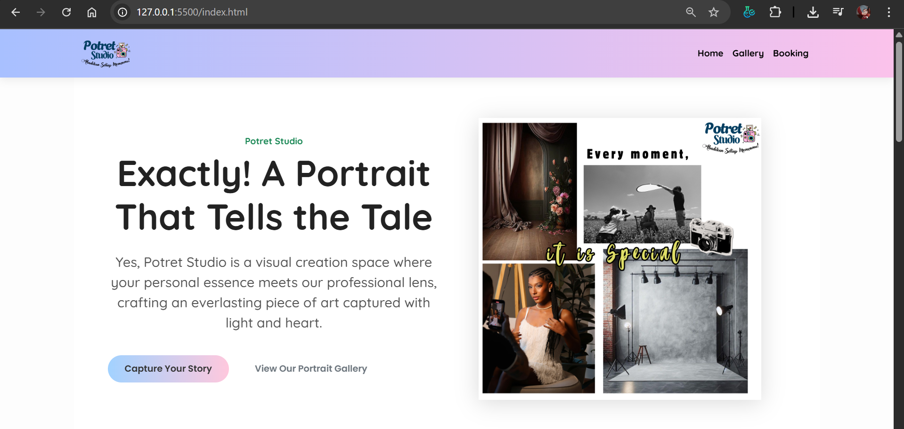

# 🌸 Website Studio Foto

Website ini dibuat sebagai media promosi dan pemesanan layanan **Studio Foto**.  
Melalui website ini, pengguna dapat melihat galeri hasil foto, koleksi peralatan kamera, latar studio, serta melakukan pemesanan jadwal sesi foto secara online melalui halaman booking.

Tujuan utama proyek ini adalah untuk memberikan pengalaman yang mudah dan menarik bagi pelanggan yang ingin mengetahui layanan yang ditawarkan oleh studio foto, sekaligus menjadi sarana digital branding yang profesional.

---

## 🖼️ Halaman Utama

1. **Home**  
   Halaman beranda yang menampilkan tampilan utama, profil singkat studio, dan informasi layanan utama.

2. **Gallery**  
   Berisi berbagai koleksi hasil foto, latar studio, serta koleksi peralatan kamera yang digunakan.  
   Terdapat beberapa bagian seperti:
   - Studio Background
   - Camera Collection
   - Catatan Penyewaan Kamera

3. **Booking**  
   Formulir untuk melakukan pemesanan sesi foto.  
   Pengguna dapat mengisi data, memilih jadwal, dan mengonfirmasi pemesanan.

4. **Contact / Testimoni**  
   Berisi informasi kontak studio (alamat, media sosial, nomor telepon) dan beberapa testimoni pelanggan.

---

## ⚙️ Teknologi yang Digunakan

Website ini dibuat menggunakan teknologi web dasar, dengan struktur yang mudah dipahami dan dapat dikembangkan lebih lanjut.

- **HTML5** – Menyusun struktur halaman
- **CSS3** – Mendesain tampilan dan tata letak
- **JavaScript** – Menambahkan interaksi sederhana (jika digunakan)
- **Bootstrap Framework** – Membantu tampilan responsif di berbagai ukuran layar
- **Gambar & Mockup (.png)** – Untuk visualisasi halaman dan konten website

---

## 📁 Struktur Folder

Struktur proyek (disederhanakan untuk memudahkan navigasi):

```
Project_Studio_Foto_Website/
│
├── Project_Studio Foto Website/
│   ├── booking.html
│   ├── gallery.html
│   ├── home.html
│   ├── Booking - Form.png
│   ├── Gallery - Camera Collection.png
│   ├── Gallery - Note Penyewaan Kamera.png
│   ├── Gallery - Studio Background.png
│   ├── Home 1.png
│   ├── Home 2.png
│   ├── Home 3 - Testi.png
│   ├── Home 4 - Contact.png
│
└── README.md
```
## PREVIEW WEBSITE


---

## 🚀 Cara Menjalankan Website

1. **Ekstrak** file ZIP proyek ini.  
2. Buka folder `Project_Studio Foto Website/`.  
3. Klik dua kali pada file `home.html` atau `index.html` (jika ada).  
4. Website akan terbuka di browser pilihan kamu (disarankan: Chrome, Edge, atau Firefox).  
5. Pastikan seluruh file gambar dan CSS tetap berada di struktur folder yang sama agar tampilan berfungsi sempurna.

---

## 🧩 Fitur yang Dapat Dikembangkan

Website ini masih dapat dikembangkan lebih lanjut dengan fitur-fitur seperti:
- Sistem **login admin** untuk mengelola galeri dan jadwal pemesanan.  
- **Database** (misalnya MySQL) untuk menyimpan data booking secara online.  
- **Formulir booking interaktif** yang terhubung ke email atau dashboard admin.  
- **Tampilan responsif penuh** di semua perangkat mobile.  

---

## 👩‍💻 Pembuat

Proyek ini dibuat oleh **Aminatus Sholikah Putri**  
Sebagai bagian dari pembelajaran dan praktik pembuatan website statis bertema *Studio Foto*.

📅 Tahun: **2025**  
📍 Tujuan: **Proyek Website Studio Foto (Belajar Web Design & Front-End)**  

---

## 📜 Lisensi

Proyek ini bersifat **terbuka (open for learning purposes)**.  
Kamu bebas memodifikasi, menyalin, atau mengembangkan lebih lanjut dengan menyertakan kredit pembuat aslinya.

---

✨ *"Fotografi adalah cara untuk menangkap momen yang tak bisa diulang — dan website ini adalah cara untuk memperkenalkannya ke dunia."* ✨

